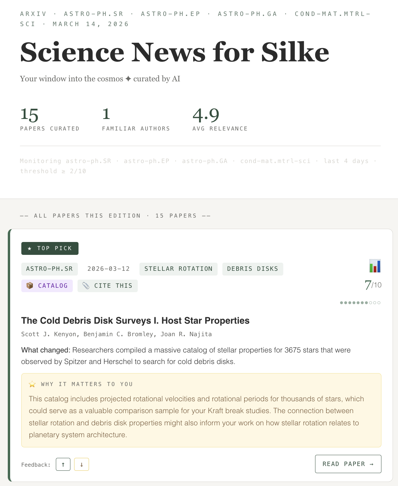
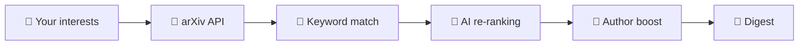

<h1 align="center">🔭 arXiv Digest</h1>
<p align="center">
  <b>Your personal arXiv paper curator</b> — fetches new papers, scores them against your research, and delivers a digest to your inbox.<br>
  <sub>
    Created by <a href="https://silkedainese.github.io">Silke S. Dainese</a> ·
    <a href="mailto:dainese@phys.au.dk">dainese@phys.au.dk</a> ·
    <a href="https://orcid.org/0009-0001-7885-2439">ORCID</a>
  </sub><br>
  <sub>
    <a href="https://arxiv-digest-setup.streamlit.app"><b>Open setup →</b></a> ·
    <a href="#quick-start">Quick Start</a> ·
    <a href="#faq">FAQ</a>
  </sub>
</p>

I built this during my PhD in astronomy at Aarhus University to stay on top of new papers without doomscrolling arXiv. Others found it useful, so I made it public — it works for anyone whose papers are on arXiv.

---

## Quick Start
1. **[Open the config page →](https://arxiv-digest-setup.streamlit.app)** — it walks you through everything, including secrets. Download `config.yaml` when done.
2. **[Fork this repo →](https://github.com/SilkeDainese/arxiv-digest/fork)** and upload `config.yaml` to the repo root.
3. Add the [secrets](https://docs.github.com/en/actions/security-for-github-actions/security-guides/using-secrets-in-github-actions) the config page told you to add.
4. Run it: `Actions` → enable workflows → `arXiv Digest` → `Run workflow`

> **That's it.** *Runs automatically Mon/Wed/Fri at 9am Danish time.*

<details>
<summary><sub>🎓 Students — there's an easier setup for you</sub></summary>

On the config page, choose the `student mini-setup`. You get pre-built interest packages (exoplanets, stars, galaxies, cosmology) with sensible defaults and a lighter weekly schedule. You can customise it later.

From another field? [Write me](mailto:dainese@phys.au.dk) and I'll set up packages for your speciality.

</details>

<p align="center">
  <br>
  <sub>Example digest email — TOP PICK card with relevance score and feedback arrows.</sub>
</p>

<details>
<summary>Something not working?</summary>

- Make sure workflows are enabled — `Actions` tab → click "I understand my workflows, go ahead and enable them"
- Secrets go in *your fork*, not the original repo
- The file must be named exactly `config.yaml` (not `config (1).yaml`) and sit in the repo root
- First run: use `Run workflow` manually to test — check the log if no email arrives
- Outlook users: set `smtp_server: "smtp.office365.com"` in `config.yaml`

</details>

---

## FAQ

### Setup

<details>
<summary>I'm a student — is there an easier way?</summary>

Yes! See the [student setup](#-students--theres-an-easier-setup-for-you) at the top of this page.

</details>

<details>
<summary>What if I don't have an invite code?</summary>

You can send digests from your own email instead. Add these secrets instead of the relay token:

- `SMTP_USER` — your email address
- `SMTP_PASSWORD` — an app password ([Gmail →](https://myaccount.google.com/apppasswords))

Outlook users: also set `smtp_server: "smtp.office365.com"` in [`config.yaml`](config.example.yaml).

</details>

<details>
<summary>Do I need an API key?</summary>

No. Keyword scoring works without any key. AI keys make the ranking smarter — add one later from [Google AI Studio](https://aistudio.google.com/apikey) (free) or [Anthropic Console](https://console.anthropic.com/). Add it as a repo secret, same way you added your other secrets.

</details>

<details>
<summary>Can I use the terminal to set up instead?</summary>

Run `python -m scripts.friend_setup` from a checkout of this repo. It opens the config page, waits for the file in Downloads, forks the repo, uploads the config, and enables Actions.

</details>

### How it works

Keywords + optional AI re-ranking + collaborator boost. Details:

<details>
<summary>How does scoring work?</summary>

You describe your research in `config.yaml` — keywords, field, a free-text description of your work, and optionally your collaborators. The digest scores every new arXiv paper in three steps:



1. Keyword matching — your keywords vs. each paper's title and abstract, weighted 1–10. Fuzzy: `planet` matches `planetary`.
2. AI re-ranking — reads your free-text research description and re-ranks by *actual relevance*, not just term overlap. The more specific your description, the better.
3. Author boost — papers by your collaborators get bumped. Papers you authored get a celebration section.

If AI is unavailable, the system cascades automatically:

| Tier | Provider | What happens |
|------|----------|--------------|
| 1 | Claude (Anthropic) | Used if you add `ANTHROPIC_API_KEY` |
| 2 | Gemini (Google) | Used if you add `GEMINI_API_KEY` |
| 3 | Keywords only | Always works — no key needed |

If one tier fails, the next takes over. You always get a digest.

</details>

<details>
<summary>How does the feedback loop work?</summary>

When you click ↑ or ↓ on a paper card in your digest email, it creates a GitHub issue in your fork. The next run reads those issues automatically — upvoted keywords get a scoring boost, downvoted ones get dampened. The system learns what you care about over time.

To enable feedback arrows, set `github_repo: "yourusername/arxiv-digest"` in [`config.yaml`](config.example.yaml).

</details>

### Using your digest

<details>
<summary>Can I change the schedule?</summary>

Yes — edit the cron line in [`.github/workflows/digest.yml`](.github/workflows/digest.yml). The default is Mon/Wed/Fri at 9am Danish time.

</details>

<details>
<summary>How do I pause or unsubscribe?</summary>

- Pause: go to your repo → `Actions` → `arXiv Digest` → click `⋯` → `Disable workflow`
- Delete: go to your repo → `Settings` → scroll to Danger Zone → `Delete this repository`

Every digest email also includes self-service links at the bottom (edit interests, pause, re-run setup, delete).

</details>

<details>
<summary>What can I customise?</summary>

See [`config.example.yaml`](config.example.yaml) for all options with inline comments. Key fields:

| Field | What it does |
|-------|-------------|
| `research_context` | Free-text description of your research — the more specific, the better |
| `keywords` | `keyword: weight` pairs (1–10) |
| `categories` | arXiv categories to monitor (e.g. `astro-ph.EP`) |
| `research_authors` | Authors whose papers get a relevance boost |
| `colleagues` | People/institutions whose papers always show |
| `digest_mode` | `highlights` (fewer, better) or `in_depth` (wider net) |
| `recipient_view_mode` | `deep_read` (full cards) or `5_min_skim` (top 3 one-liners) |
| `self_match` | Your name as it appears on arXiv — triggers a celebration when you publish |

</details>

<details>
<summary>Can I run it locally?</summary>

```bash
pip install -r requirements.txt
python digest.py --preview        # renders in browser, no email
python digest.py                  # full run (needs RECIPIENT_EMAIL + email secrets)
cd setup && streamlit run app.py  # run the config page locally
```

</details>

---

## License

MIT — see [LICENSE](LICENSE). Maintainers: see [CONTRIBUTING.md](CONTRIBUTING.md).
