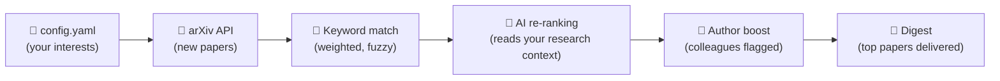

# 🔭 arXiv Digest

**Your personal arXiv paper curator** — fetches new papers, scores them against your research, and delivers a digest to your inbox.


Created by [Silke S. Dainese](https://silkedainese.github.io) · [dainese@phys.au.dk](mailto:dainese@phys.au.dk) · [ORCID](https://orcid.org/0009-0001-7885-2439)

I built this for myself — I am a PhD student in astronomy at Aarhus University and I wanted a smarter way to stay on top of new papers. Other people found it useful, so I made it public. It works for anyone on arXiv.

> **For students:** The setup wizard has a simpler astronomy path with pre-built interest packages. If you want something similar for your field, [write me](mailto:dainese@phys.au.dk).

---

## Quick Start

Three steps. No terminal needed.

### 1. Generate your config

**[Open the setup wizard →](https://arxiv-digest-setup.streamlit.app)**

Fill in your name, research description, keywords, and email address. Download the `config.yaml` file it generates.

### 2. Fork this repo

**[Fork arXiv Digest →](https://github.com/SilkeDainese/arxiv-digest/fork)**

This creates your own copy. Everything runs in your fork — nothing is shared back.

### 3. Upload your config, add secrets, and run

In your fork: **Add file → Upload files** → drag in `config.yaml` → **Commit changes**.

Then add [GitHub Actions secrets](https://docs.github.com/en/actions/security-for-github-actions/security-guides/using-secrets-in-github-actions):

- `RECIPIENT_EMAIL` — where your digest arrives
- **Email delivery** (pick one):
  - `DIGEST_RELAY_TOKEN` — if the maintainer gave you an invite code
  - `SMTP_USER` + `SMTP_PASSWORD` — to send from your own mailbox ([Gmail App Password →](https://myaccount.google.com/apppasswords))
- **Optional:** `GEMINI_API_KEY` ([free →](https://aistudio.google.com/apikey)) or `ANTHROPIC_API_KEY` for AI-powered scoring

Then go to **Actions** → enable workflows → click **arXiv Digest** → **Run workflow**.

**That's it.** Your digest now runs automatically **Mon/Wed/Fri at 9am Danish time**.

<details>
<summary>Prefer a terminal flow?</summary>

Run `python -m scripts.friend_setup` from a checkout of this repo. It opens the setup wizard, waits for `config.yaml` in Downloads, forks the repo, uploads the config, and enables Actions.

</details>

---

> **Do I need an API key?** No — keyword scoring works without any key. AI keys improve quality but are optional.
> **Can I change the schedule?** Yes — edit the cron line in `.github/workflows/digest.yml`.
> **Can I run it locally?** `python digest.py --preview` renders a digest in your browser without sending email.
> **How do I pause or unsubscribe?** Disable the workflow or delete the fork — see [Managing Your Digest](#managing-your-digest).
> **How do I give feedback on papers?** Click the ↑/↓ arrows on each card. Future digests learn from your votes.

---

## How Scoring Works

You describe your research in `config.yaml` — your keywords, your field, a free-text description of what you work on, and optionally your collaborators. The digest uses that profile to score every new arXiv paper in three steps:



**Step 1 — Keyword matching.** Your keywords are matched against each paper's title and abstract, weighted by the importance you assigned (1–10). The matcher is fuzzy on purpose: plurals, hyphenation, and close variants like `planet` / `planetary` are treated as related. Papers below a minimum score are filtered out.

**Step 2 — AI re-ranking.** If you have an AI key, the AI reads your `research_context` — your free-text research description — and re-ranks the keyword-matched papers by *actual relevance* to your work, not just term overlap. The more specific your description, the better the scoring.

**Step 3 — Author boost.** Papers by your `research_authors` get a relevance bump. Papers you authored yourself get a celebration section. Colleagues are always shown regardless of score.

**What if AI is unavailable?** The system cascades automatically:

| Tier | Provider | What happens |
|------|----------|--------------|
| 1 | **Claude** (Anthropic) | Used if you add `ANTHROPIC_API_KEY` |
| 2 | **Gemini** (Google) | Used if you add `GEMINI_API_KEY` |
| 3 | **Keywords only** | Always works — no key needed |

If one tier fails, the next takes over. You always get a digest.

**Feedback loop.** When you click ↑/↓ on a paper card, it creates a GitHub issue that the next run ingests. Upvoted keywords get a scoring boost; downvoted ones get dampened. The system learns what you care about over time.

---

## Optional Upgrades

| Upgrade | What it does | How to set it up |
|---------|--------------|------------------|
| **Your own AI key** | Better paper ranking | Add `GEMINI_API_KEY` or `ANTHROPIC_API_KEY` as a repo secret. Set `own_api_key: true` in config.yaml |
| **Feedback arrows** | ↑/↓ buttons to improve future scoring | Set `github_repo: "yourusername/arxiv-digest"` in config.yaml |
| **Keyword tracking** | Track which keywords match papers over time | **Settings → Actions → General → Workflow permissions** → "Read and write" |

---

<details>
<summary><strong>Config Reference</strong></summary>

See [`config.example.yaml`](config.example.yaml) for all options with inline comments.

| Field | Description |
|-------|-------------|
| `research_context` | Free-text description of your research (used by AI scoring) — the more specific, the better |
| `keywords` | Dictionary of `keyword: weight` pairs (1–10) |
| `keyword_aliases` | Optional `keyword: [similar phrases]` overrides for brittle terminology |
| `categories` | arXiv categories to monitor |
| `self_match` | How your name appears in arXiv author lists — triggers a celebration section when you publish |
| `research_authors` | Authors whose papers get a relevance boost |
| `colleagues` | People/institutions whose papers always show; people can carry an optional `note` shown in the digest |
| `digest_mode` | `highlights` (fewer, higher-quality picks) or `in_depth` (wider net, more papers) |
| `recipient_view_mode` | `deep_read` (full cards) or `5_min_skim` (top 3 one-line summaries) |
| `github_repo` | Your fork's path, e.g. `janedoe/arxiv-digest` — enables feedback arrows and self-service links |
| `setup_url` | Optional override for the "Re-run setup wizard" footer link |

</details>

<details>
<summary><strong>Managing Your Digest</strong></summary>

Every digest email includes self-service links at the bottom:

- **Edit interests** → opens `config.yaml` in GitHub's web editor
- **Pause** → links to the Actions tab (disable the workflow)
- **Re-run setup** → opens the setup wizard
- **Delete** → links to repo Settings (Danger Zone → Delete repository)

Each paper card includes feedback arrows when `github_repo` is set:

- **↑** = relevant (more like this)
- **↓** = not relevant (less like this)

**To unsubscribe:** Disable the workflow (pause) or delete the fork (permanent).

</details>

---

## Development

```bash
pip install -r requirements.txt
python digest.py --preview        # renders in browser, no email
python digest.py                  # full run (needs RECIPIENT_EMAIL + email secrets)
cd setup && streamlit run app.py  # run the setup wizard locally
```

Outlook users: set `smtp_server: "smtp.office365.com"` in config.yaml. Maintainers: see [CONTRIBUTING.md](CONTRIBUTING.md) for invite code setup.

---

## License

MIT — see [LICENSE](LICENSE).

**Created by [Silke S. Dainese](https://silkedainese.github.io)** · Aarhus University · Dept. of Physics & Astronomy
