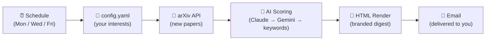

# 🔭 arXiv Digest

**Your personal arXiv paper curator** — fetches new papers, scores them with AI, and delivers a beautiful HTML digest to your inbox.

Created by [Silke S. Dainese](https://silkedainese.github.io) · [dainese@phys.au.dk](mailto:dainese@phys.au.dk) · [ORCID](https://orcid.org/0009-0001-7885-2439)

I built this for myself. I am a PhD student in astronomy at Aarhus University — not a software developer — and I wanted a smarter way to stay on top of new arXiv papers without spending an hour every morning. Other people in my department found it useful, so I cleaned it up and made it public. It is primarily aimed at people in physics and astronomy, but it will work for anyone on arXiv.

If you have suggestions, open an issue or [email me](mailto:dainese@phys.au.dk). I cannot promise to implement them — my research comes first.

> **For students:** The setup wizard includes a simple student-friendly astronomy path with pre-built interest packages and lighter weekly defaults. If you are from another field and would like something similar for your speciality, [write me](mailto:dainese@phys.au.dk) and I will set it up.

*Built with the help of Claude Opus and Sonnet 4.6.*

---

## How arXiv Digest Works

This is **not a chatbot**. It is an automated pipeline that runs on a schedule, scores papers against your research profile, and delivers results to your inbox. You never interact with it — it just works.



**What makes it different from other paper tools:**

- **No login, no app, no chat** — it runs as a GitHub Actions cron job in your fork. Papers arrive in your email on schedule.
- **Three-tier scoring cascade** — papers are ranked by Claude, then Gemini, then keyword matching as fallback. If one tier is unavailable, the next takes over automatically. You always get a digest.
- **Research-profile aware** — the AI doesn't just match keywords. It reads your full `research_context` (a free-text description of your work, your [ORCID](https://orcid.org) profile, your active collaborators) and scores papers for *relevance to your actual research*, not just term overlap.
- **Author and colleague detection** — papers by your known collaborators get flagged. Papers you authored yourself get a celebration section. Colleagues can carry notes (e.g. "PhD advisor", "same instrument team").
- **Feedback loop** — ↑/↓ arrows on each paper card create GitHub issues that are automatically ingested to nudge future scoring. The system learns what you care about.
- **Zero lock-in** — everything runs in your GitHub fork. Your config, your secrets, your schedule. Delete the fork and it's gone.

> *A real digest email. Papers are scored for your research profile and delivered on schedule — no interaction required.*


---

## Quick Start

Three steps plus one email-delivery secret. No terminal.

Prefer a terminal flow? Run `python -m scripts.friend_setup` from a checkout of this repo. It opens the setup wizard, waits for `config.yaml` in Downloads, forks the repo, uploads the config, enables Actions, and then walks you through one of three setup modes:

- invite token / relay
- your own Gmail / SMTP
- repo only for now, with secrets added later

### 1. Generate your config

**[Open the setup wizard →](https://arxiv-digest-setup.streamlit.app)**

Fill in your name, research description, keywords, and the email address where you want your digest. The wizard generates a `config.yaml` file — download it.

> **Students:** Choose the student mini-setup if you want a simpler weekly config built from broad astronomy interest packages. You can customise it later.

### 2. Fork this repo

**[Fork arXiv Digest →](https://github.com/SilkeDainese/arxiv-digest/fork)**

This creates your own copy. Everything runs in your fork — nothing is shared back.

### 3. Upload your config, add secrets, and run

In your fork: **Add file → Upload files** → drag in `config.yaml` → **Commit changes**.

Then add these GitHub Actions secrets:

- `RECIPIENT_EMAIL`
- And one email delivery method:
- Either `DIGEST_RELAY_TOKEN` if the maintainer gave you an invite code and the setup wizard revealed a relay token
- Or your own `SMTP_USER` and `SMTP_PASSWORD`
- Optional: `GEMINI_API_KEY` or `ANTHROPIC_API_KEY` for repo-side AI scoring

Then:

1. Go to the **Actions** tab → click **"I understand my workflows, go ahead and enable them"**
2. Click **arXiv Digest** in the left sidebar → **Run workflow** → **Run workflow**

Your first digest email should arrive within a few minutes. If something goes wrong, the workflow log tells you exactly what to fix.

**That's it.** Your digest now runs automatically **Mon/Wed/Fri at 9am Danish time**. Papers show up in your inbox — no further action needed.

---

> **Do I need an API key?** No — keyword scoring works without any key. AI keys improve quality but are optional.
> **Can I change the schedule?** Yes — edit the cron line in `.github/workflows/digest.yml`.
> **Can I run it locally?** `python digest.py --preview` renders a digest in your browser without sending email.
> **How do I pause or unsubscribe?** Disable the workflow or delete the fork — see [Managing Your Digest](#managing-your-digest).
> **How do I give feedback on papers?** Click the ↑/↓ arrows on each card. Future digests learn from your votes.

---

## Optional Upgrades

Some extras are optional; email delivery is not.

| Upgrade | What it does | How to set it up |
|---------|--------------|------------------|
| **Your own AI key** | Faster, more reliable scoring | Add `GEMINI_API_KEY` ([free →](https://aistudio.google.com/apikey)) or `ANTHROPIC_API_KEY` ([→](https://console.anthropic.com/)) as a [repo secret](https://docs.github.com/en/actions/security-for-github-actions/security-guides/using-secrets-in-github-actions). Set `own_api_key: true` in config.yaml |
| **Feedback arrows** | ↑/↓ buttons on each paper to improve future scoring | Set `github_repo: "yourusername/arxiv-digest"` in config.yaml |
| **Keyword tracking** | Track which keywords match papers over time | **Settings → Actions → General → Workflow permissions** → "Read and write" |
| **Own email sender** | Send from your own Gmail/Outlook instead of using a maintainer-provided relay token | Add `SMTP_USER` and `SMTP_PASSWORD` as [repo secrets](https://docs.github.com/en/actions/security-for-github-actions/security-guides/using-secrets-in-github-actions) ([Gmail App Password →](https://myaccount.google.com/apppasswords)) |

---

<details>
<summary><strong>Scoring details</strong> — how papers are ranked</summary>

| Tier | Provider | Quality | What happens |
|------|----------|---------|--------------|
| 1 | **Claude** (Anthropic) | Best | Used if you add an `ANTHROPIC_API_KEY` |
| 2 | **Gemini 2.0 Flash** (Google) | Good | Used if you add a `GEMINI_API_KEY` |
| 3 | **Keyword fallback** | Basic | Automatic fallback if AI is unavailable |

If one tier fails, it cascades to the next. You always get a digest.

1. **Keyword matching** — your keywords are checked against each paper's title and abstract, weighted by the importance you assigned (1–10). The matcher is fuzzy: plurals, hyphenation, and close variants are treated as related.
2. **AI re-ranking** — the AI reads your `research_context` and re-ranks papers for relevance to your actual research, not just term overlap.
3. **Author boost** — papers by your `research_authors` get a relevance bump. Papers you authored yourself get a celebration section.

</details>

---

## Config Reference

See [`config.example.yaml`](config.example.yaml) for all options with inline comments.

| Field | Description |
|-------|-------------|
| `research_context` | Free-text description of your research (used by AI scoring) — the more specific, the better |
| `keywords` | Dictionary of `keyword: weight` pairs (1–10) |
| `keyword_aliases` | Optional `keyword: [similar phrases]` overrides for brittle terminology |
| `categories` | arXiv categories to monitor |
| `self_match` | How your name appears in arXiv author lists — triggers a celebration section when you publish |
| `research_authors` | Authors whose papers get a relevance boost |
| `colleagues` | People/institutions whose papers always show; people can carry an optional `note` shown in the digest |
| `digest_mode` | `highlights` (fewer, higher-quality picks) or `in_depth` (wider net, more papers) |
| `recipient_view_mode` | `deep_read` (full cards) or `5_min_skim` (top 3 one-line summaries) |
| `github_repo` | Your fork's path, e.g. `janedoe/arxiv-digest` — enables self-service links and feedback arrows. On GitHub Actions the current repo is auto-detected, so renamed forks keep working |
| `setup_url` | Optional override for the "Re-run setup wizard" footer link if your public Streamlit URL changes |

---

## Managing Your Digest

Every digest email includes self-service links at the bottom:

- **Edit interests** → opens `config.yaml` in GitHub's web editor
- **Pause** → links to the Actions tab (disable the workflow)
- **Re-run setup** → opens the setup wizard
- **Delete** → links to repo Settings (Danger Zone → Delete repository)

Each paper card also includes quick feedback arrows when `github_repo` is set:

- **↑** = relevant (more like this)
- **↓** = not relevant (less like this)

These create labeled GitHub issues (`digest-feedback`) that are automatically ingested to nudge future ranking.

### How to Unsubscribe

1. **Pause**: Go to your repo → Actions → arXiv Digest → click ⋯ → Disable workflow
2. **Delete**: Go to your repo → Settings → scroll to Danger Zone → Delete this repository

---

## Email Setup

Pick one safe email setup:

1. If the maintainer gave you an invite code, enter it in the setup wizard and copy the revealed secrets into your repo.
2. Or add `SMTP_USER` and `SMTP_PASSWORD` to send from your own mailbox.

Gmail users need an [App Password](https://myaccount.google.com/apppasswords); Outlook users should also set `smtp_server: "smtp.office365.com"` in their `config.yaml`. Maintainers: see [CONTRIBUTING.md](CONTRIBUTING.md) for invite code setup.

---

## Development

```bash
pip install -r requirements.txt
python digest.py --preview        # renders in browser, no email
python digest.py                  # full run (needs RECIPIENT_EMAIL + email secrets)
cd setup && streamlit run app.py  # run the setup wizard locally
```

---

## License

MIT — see [LICENSE](LICENSE).

**Created by [Silke S. Dainese](https://silkedainese.github.io)** · Aarhus University · Dept. of Physics & Astronomy
